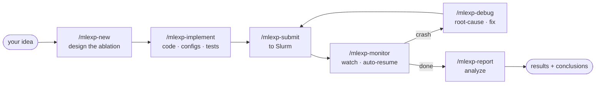
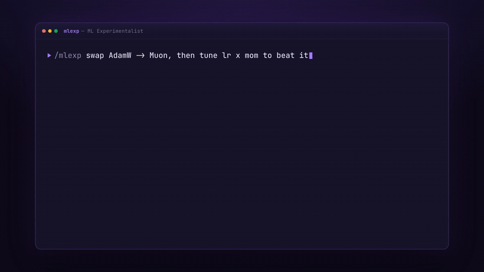
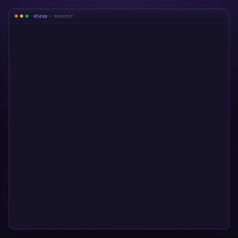
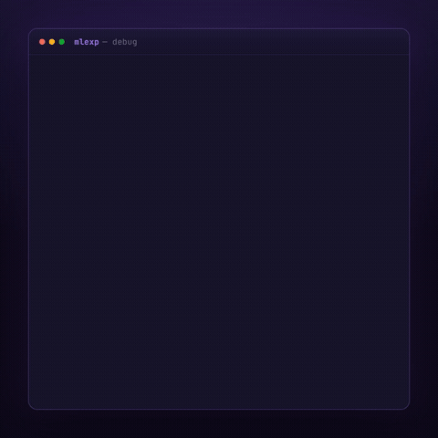
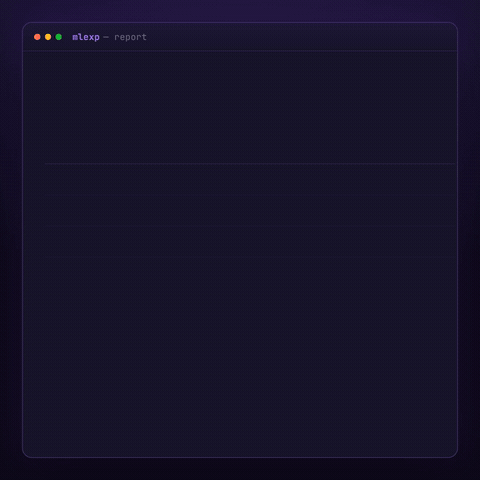
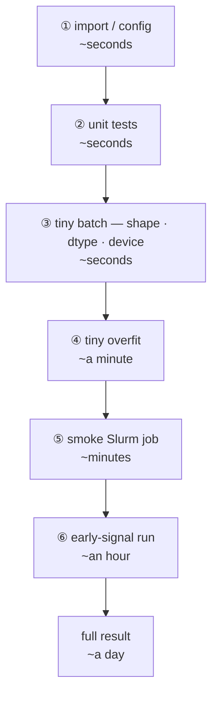
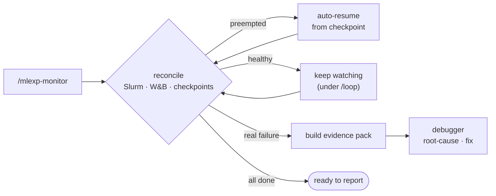
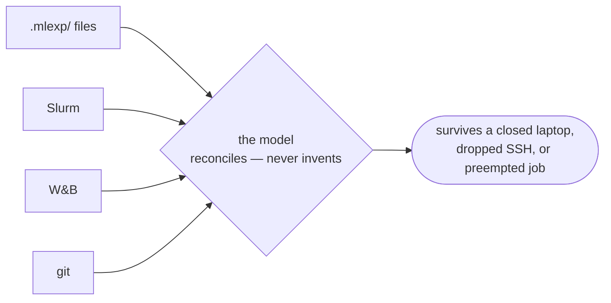

# MLEXP — ML Experimentalist

> Bring an idea. Get back conclusions.


A Claude Code plugin that runs the ML experiment lifecycle with you: design the
ablation, implement it, submit to Slurm, monitor and auto-resume, debug the
crashes, and write up the results. What comes back is a table and a short decision
memo that answers the question you started with.

State lives in files, not the model's memory, so a closed laptop, a dropped SSH, or
a preempted job never loses your place. You stay in the loop for the calls that
change the science — the ablation design, the implementation plan, and sign-off on
any code or config fix. The operational grind runs on its own: it submits, monitors,
auto-resumes, fixes a bad submit parameter or a dead node, and writes up the results
unattended. You direct the science; MLEXP runs the experiments.



<!-- Hero demo — rendered from HTML with HyperFrames (deterministic HTML→video).
     To regenerate or swap it, see assets/RECORDING.md. -->
<p align="center">
  
</p>

## Why

ML feedback is a day away, so small mistakes are expensive. MLEXP is built to make
them cheap to catch and easy to recover from.

| Problem | What MLEXP does |
|---|---|
| You burn a GPU-day, then hit a shape bug in epoch 1. | The slow-feedback ladder catches it in seconds, before the expensive run ever starts. |
| A job is preempted at hour 6 and you find out at hour 12. | `/mlexp-monitor` auto-resumes from the last checkpoint. Preemption isn't failure. |
| "Which configs did I actually run?" | `/mlexp-new` freezes the ablation matrix and the primary-metric protocol up front — which metric, eval, and budget decide the winner, fixed before you see any results. |
| Writing up means hand-scraping W&B into tables. | `/mlexp-report` returns the tables and a conclusion memo — the verdict uses only the metric you froze, with exploratory findings kept separate. |

## The commands

Each one is a Claude Code skill. Type the `/mlexp-*` command, or just describe what
you want and the right one triggers. Every phase runs standalone, so you can jump in
anywhere — including adopting jobs you launched by hand.

| Command | Plain-English ask | What it does |
|---|---|---|
| `/mlexp` | "help me with my experiments" | Orients you, detects the current phase, routes to the right command. |
| `/mlexp-new` | "help me design this ablation" | Works through the study with you, writes the plan, and freezes the primary-metric protocol. |
| `/mlexp-implement` | "implement variant X, add configs + tests" | Sets up a worktree, configs, code, and tests behind the cheap feedback-ladder gates. |
| `/mlexp-submit` | "submit these jobs" | Renders submit scripts to your cluster's conventions, gates on a smoke run, sbatch's, and records every attempt. |
| `/mlexp-monitor` | "check on my jobs" | Reconciles Slurm, W&B, and checkpoints, auto-resumes interruptions, and dispatches the debugger on real failures. |
| `/mlexp-debug` | "why did this die — fix it" | Turns an evidence pack into a root cause, a fix, and a resubmission recommendation. |
| `/mlexp-report` | "write up the results" | Pulls W&B histories into tables, figures, and a decision memo. |

> Run the monitor under `/loop` (e.g. `/loop 15m /mlexp-monitor <study>`) and it keeps
> reconciling, auto-resuming, and triaging failures until the study finishes — making
> its own operational calls (resume, requeue, fix a bad submit parameter or a dead
> node) and pinging you only to sign off a code or config fix. No daemon and nothing
> to install; it lives with your Claude Code session.

## Quickstart

You'll need Claude Code, a Slurm cluster you can submit to, and (optionally) a
Weights & Biases project. Install once per machine; it's then available in every
project and session:

```bash
claude plugin marketplace add https://github.com/pengzhangzhi/MLEXP.git   # registers the "mlexp" marketplace
claude plugin install mlexp@mlexp   # the "mlexp" plugin from it
claude plugin list      # verify, then restart Claude Code
```

Then just describe the experiment:

```text
> /mlexp
  …or, in plain English: "replace AdamW with Muon and tune it to beat the baseline"
```

The first run sets up a small `.mlexp/` config from your existing W&B settings and
cluster docs, so there's almost nothing to fill in.

### See it in action

<!-- Lifecycle demos — rendered from HTML with HyperFrames. See assets/RECORDING.md. -->
<table>
  <tr>
    <td align="center"><br/><sub><b>monitor</b> — catch & auto-resume a preemption</sub></td>
    <td align="center"><br/><sub><b>debug</b> — root-cause a divergence and fix it</sub></td>
    <td align="center"><br/><sub><b>report</b> — tables + a conclusion memo</sub></td>
  </tr>
</table>

---

<details>
<summary><b>How it works — the slow-feedback ladder</b> <i>(why MLEXP exists)</i></summary>

<br/>

A typo shouldn't cost you a GPU-day. ML's real feedback is a day away, so MLEXP
decomposes that one-day verdict into cheap proxy checks and won't spend an expensive
rung until the cheap one is green — catching the bug in seconds, before the job ever
reaches the queue.



Each rung is a gate: cheap and fast at the bottom, expensive and slow at the top.

</details>

<details>
<summary><b>How it works — the monitor / auto-resume loop</b></summary>

<br/>

`/mlexp-monitor` doesn't trust the model's memory. It re-derives state from Slurm,
W&B, and your checkpoints every time. Preemptions resume themselves; only real
failures get escalated to the debugger with a full evidence pack.



</details>

<details>
<summary><b>Vocabulary — Study, Experiment, Attempt</b></summary>

<br/>

```
Study  ──<  Experiment  ──<  Attempt  ──→  slurm_job_id, wandb_run_id(s)
```

- **Study** — one research objective and its set of experiments. Owns the frozen
  primary-metric protocol.
- **Experiment** — one logical training target = `variant × seed`.
- **Attempt** — one Slurm submission of an experiment. A preemption starts a new
  attempt of the *same* experiment, never a new experiment.

</details>

<details>
<summary><b>Where state lives</b> <i>(files are the truth)</i></summary>

<br/>

The plugin is just markdown. Your experiment state lives in your research repo under
a single `.mlexp/` directory, never in the plugin:

```
<your-repo>/.mlexp/                  # the one MLEXP dir — everything lives here
  config.yaml                        # wandb defaults + active cluster profile
  memory/                            # durable memory (lessons / failure patterns / playbook)
  studies/<study>/                   # study.yaml, protocol.lock.yaml, per-experiment
                                     #   + per-attempt state, evidence, analysis
```



When you come back and run a command, MLEXP reconciles from ground truth. See
[`references/file-layout.md`](references/file-layout.md) for the exact schema.

</details>

<details>
<summary><b>Configure your cluster</b></summary>

<br/>

If your repo already documents the cluster (a `CLAUDE.md`, project memory, or docs
that tell the agent how to submit jobs, grab a debug GPU, activate the env, and where
checkpoints live), MLEXP defers to it. Make your profile a one-line pointer:

```yaml
# .mlexp/cluster-<name>.md
inherits: ../CLAUDE.md
```

Otherwise, copy [`references/cluster-template.md`](references/cluster-template.md) to
`.mlexp/cluster-<name>.md`, fill in your site's account, partitions, paths, and
activation, and set `cluster_profile: <name>` in `.mlexp/config.yaml`. Keep that file
gitignored if it has site-internal details — the plugin never needs it.

</details>

## What it isn't

No Python, no helper scripts, no database, no daemon, no web UI. It runs the
operational grind unattended but checks in before changing the science — you sign off
on the design, the plan, and any code or config fix. It won't invent research
directions, edit your baselines, delete checkpoints, or merge to main on its own — it
surfaces those as recommendations for you to decide.

## License & docs

- License: [MIT](LICENSE)
- [`VALIDATION.md`](VALIDATION.md) — the acceptance scenarios that define "working":
  orthogonal state, preemption→resume, failure→debug, idempotency, autonomous
  operation, and report separation.
- [`references/`](references/) — the state model, file layout, protocol rules, and
  feedback ladder the skills follow.

<sub>A <a href="https://docs.claude.com/en/docs/claude-code">Claude Code</a> plugin — pure prompt, on-demand.</sub>
